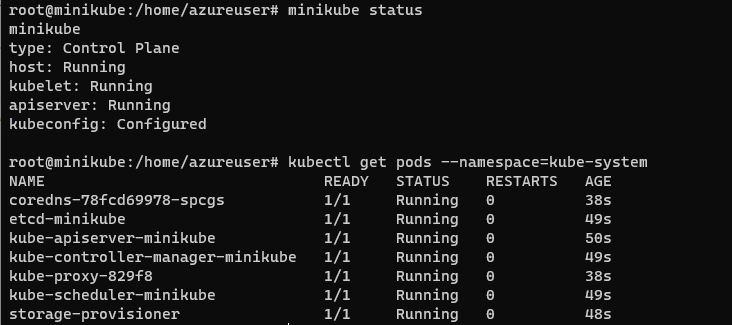
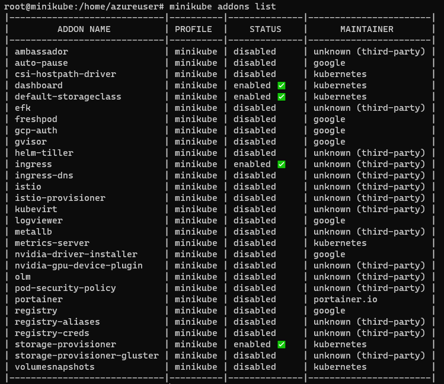
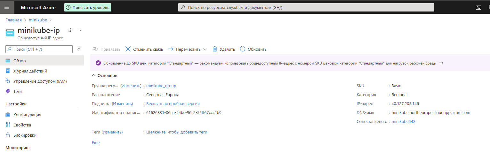
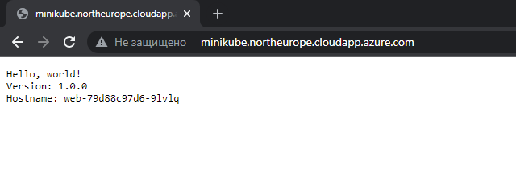
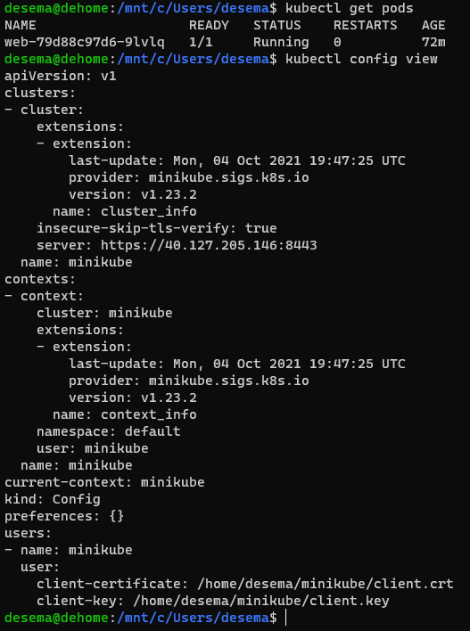
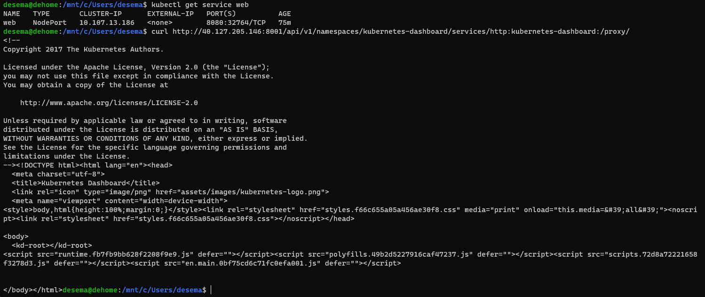

# Задача 1: Установить Minikube
 Зарегал аккаунт в Azure.
   Установил minikube и вывел список подов. 
 
# Задача 2: Запуск Hello World
Поставил аддоны Dashboard и Ingress.

  Настроил Ingress по доменному имени.

# Задача 3: Установить kubectl
Установил kubectl на локальный WSL. Скопировал настройки кластера с ключами, прокинул порт в Azure, поставил флаг игнора tls для кластера.

 Запустил курл до удаленного dashboard для проверки.

